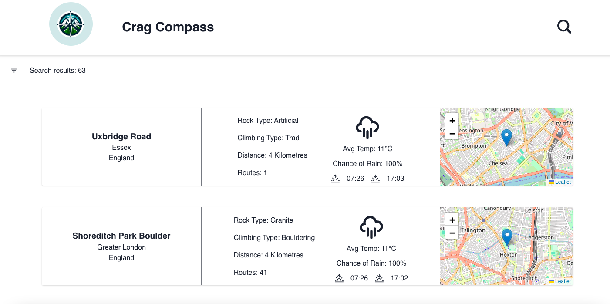

### Crag Compass

Crag Compass is an innovative web application designed to assist climbers in discovering new climbing locations and crags around the world. It offers an intuitive interface that enables users to easily search for climbing spots based on their preferences, including location, difficulty level, weather and type of climbing (such as bouldering, sport climbing, or traditional climbing). Whether you're a seasoned climber looking for a new challenge or a beginner eager to explore the climbing world, Crag Compass is your go-to resource for finding the perfect crag.

- Frontend in React with Vite, Typescript. Backend in Express, Sequelize and PostgreSQL.
- Puppeteer to web-scrape and fill the database with relevant information for the application.
- Multiple APIs for the location, weather and directions.

### Next features to be implements

- Improve NavBar and Modal component modularization.
- Enhance route data collection for each crag by upgrading the webscraper to extract detailed information from UKC, including route popularity, crag details, access status, and approach times.
- Introduce a "favourite crags" feature, allowing users to save preferred crags and view extended information, including driving times between them.
- Implement autocomplete for location input to validate addresses for geocoding.
- Upgrade weather data presentation by enriching the current information sourced from the weather URL.

### Getting Started:

### Client

- Move into client folder: `cd client`
- Run `npm i`
- To run the front-end: `npm run dev`

### Server

- Move into server folder: `cd server`
- Run `npm i`
- Change any config information in the .config.js file, such as username and password for you PostgreSQL account - ensure you have PostGreSQL set up
- To run the server: `npm run dev`

### Webscraper

To fill the database with data follow these instructions:

1.  Ensure the server is running properly
2.  Move into the webscraper foler: `cd webscraper`
3.  Run `npm i`
4.  Determine what set of information you want to scrape. For Example, the current URL is 'https://www.ukclimbing.com/logbook/crags/?location=Leeds&distance=50'. This will get all the crags within 50 miles of Leeds. (you beed to ensure the database is up an running and accepting requests)
5.  Run `node script.js` to run the script and scrape the data as well as the scraped data to your database.
